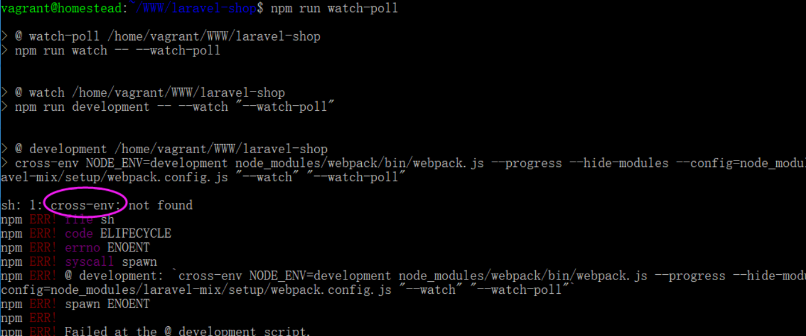

##问题一
>npm run watch-poll 的时候 报错

解决
~~~
#安装 cross-env
cnpm install cross-env --save-dev
cnpm install
npm run watch-poll
~~~

##问题一
>yarn add china-area-data安装报错

解决
~~~
cnpm install china-area-data
~~~

##路由冲突另一种解决方式（正则表达式约束）
~~~php
<?php
//restful 查看
Route::get('products/{product}', 'ProductsController@show')->name('products.show');

//收藏
Route::get('products/favorites', 'ProductsController@favorites')->name('products.favorites');
~~~
教程中给出的一种解决方式是将两个路由的位置进行上下调整，当项目变的越来越大，
路由增多后，这样的操作可能会给后期挖坑,所以建议增加 where 条件限制

~~~php
<?php
//restful 查看，product仅支持数整，当id规则变更后，只需更改正则条件
Route::get('products/{product}', 'ProductsController@show')->name('products.show')->where(['product' => '[0-9]+']);
~~~

